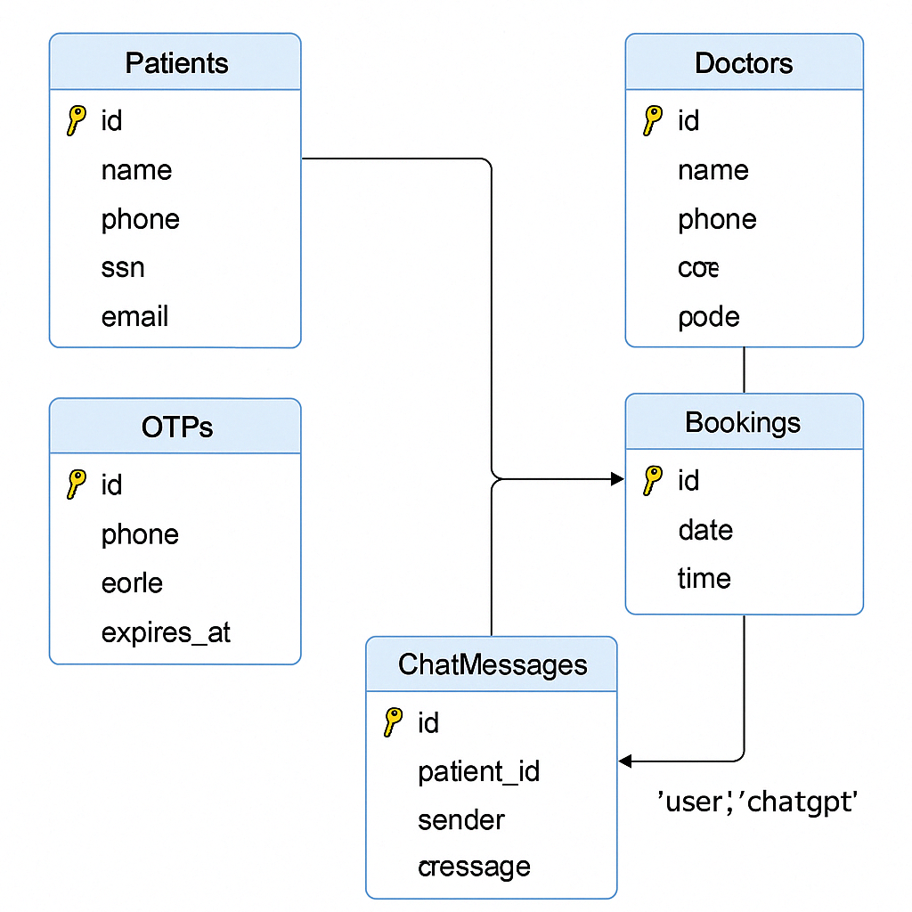

# app-care-db

# 🩺 Vårdappen – Backend

Detta är backend-delen av Vårdappen, byggd med Node.js och Express. Systemet hanterar OTP-inloggning, bokningar, e-post, SMS och AI-baserad chat med OpenAI.

## 📁 Struktur

```
backend/
├── controllers/
│   ├── authController.js
│   ├── bookingController.js
│   ├── chatController.js ✅
│   ├── patientsController.js
│   └── smsController.js
├── routes/
│   ├── auth.js
│   ├── bookings.js
│   ├── chat.js ✅
│   ├── doctors.js
│   ├── patients.js
│   └── sms.js
├── utils/
│   └── sendSMS.js
├── db.js
├── app.js
├── create-tables.js
└── package.json
```

## 🧠 Funktioner

- 🔐 OTP-inloggning via SMS (Brevo)
- 🩺 Registrering och inloggning för patienter och läkare
- 📅 Bokningssystem med möteslänk
- 💬 Chat med AI (OpenAI API)
- ✅ Automatisk lagring av chatthistorik för inloggade patienter

## 🛠️ Installation

```bash
cd backend
npm install
node app.js
```

## 🗺 ER-Diagram



> Diagrammet visar relationen mellan patienter, läkare, bokningar och OTP-tabellen.

---

## 🧮 Databastabeller (MySQL)

```sql
CREATE TABLE IF NOT EXISTS Patients (
  id BIGINT AUTO_INCREMENT PRIMARY KEY,
  name VARCHAR(100) NOT NULL,
  phone VARCHAR(20) NOT NULL UNIQUE,
  ssn VARCHAR(20) NOT NULL UNIQUE,
  email VARCHAR(100) NOT NULL UNIQUE
);

CREATE TABLE IF NOT EXISTS Doctors (
  id INT AUTO_INCREMENT PRIMARY KEY,
  name VARCHAR(100) NOT NULL,
  phone VARCHAR(20),
  ssn VARCHAR(12),
  code VARCHAR(10) NOT NULL UNIQUE
);

CREATE TABLE IF NOT EXISTS Bookings (
  id BIGINT AUTO_INCREMENT PRIMARY KEY,
  date DATE NOT NULL,
  time VARCHAR(10) NOT NULL,
  meetingLink TEXT NOT NULL,
  patient_id BIGINT NOT NULL,
  FOREIGN KEY (patient_id) REFERENCES Patients(id) ON DELETE CASCADE
);

CREATE TABLE IF NOT EXISTS OTPs (
  id INT AUTO_INCREMENT PRIMARY KEY,
  phone VARCHAR(20) NOT NULL UNIQUE,
  code VARCHAR(10) NOT NULL,
  expires_at DATETIME NOT NULL
);

CREATE TABLE IF NOT EXISTS ChatMessages (
  id BIGINT AUTO_INCREMENT PRIMARY KEY,
  patient_id BIGINT,
  sender ENUM('user', 'chatgpt') NOT NULL,
  message TEXT NOT NULL,
  created_at TIMESTAMP DEFAULT CURRENT_TIMESTAMP,
  FOREIGN KEY (patient_id) REFERENCES Patients(id) ON DELETE CASCADE
);
```

## 🔌 API-rutter

### Patienter:
- `POST /api/patients/register`
- `POST /api/patients/login`
- `POST /api/patients/check-phone`
- `DELETE /api/patients/:id`

### OTP:
- `POST /api/otp/send`
- `POST /api/otp/verify`

### Läkare:
- `POST /api/doctors/login`

### Bokningar:
- `GET /api/bookings/available-times?date=YYYY-MM-DD`
- `POST /api/bookings`
- `DELETE /api/bookings/:id`

### Chat:
- `POST /api/chat` – Skicka fråga till GPT och spara (om inloggad)
- `GET /api/chat/:patientId` – Hämta historik för patient

## ✅ Exempel på .env

```
DB_HOST=localhost
DB_USER=root
DB_PASSWORD=your_password
DB_NAME=booking_db
OPENAI_API_KEY=sk-...
BREVO_API_KEY=...
DATABASE_URL=...
VITE_BREVO_API_KEY=...

```

## 📄 Licens

© 2025 Alexander Gallorini & Filip Kostic – IT - Högskolan
